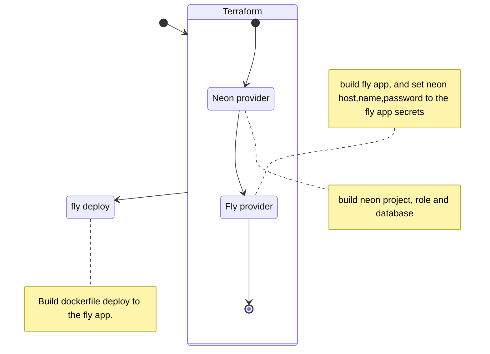

## Environment

* Rust stable
* sqlx
* psql
* docker
> online
* Terraform
* fly CLI
* GNU make

## Infrastructure
[//]: # (https://mermaid.js.org/syntax/stateDiagram.html)

* https://fly.io host online test project
* https://neon.tech host online test database
* https://app.terraform.io host terraform state, execute in the local
* [terraform-community-providers/neon](https://registry.terraform.io/providers/terraform-community-providers/neon/latest) terraform neon provider
* [floydspace/fly]( https://registry.terraform.io/providers/floydspace/fly/latest) terraform fly provider[^not official]

[^not official]: https://github.com/fly-apps/terraform-provider-fly/pull/106#issuecomment-1501199345